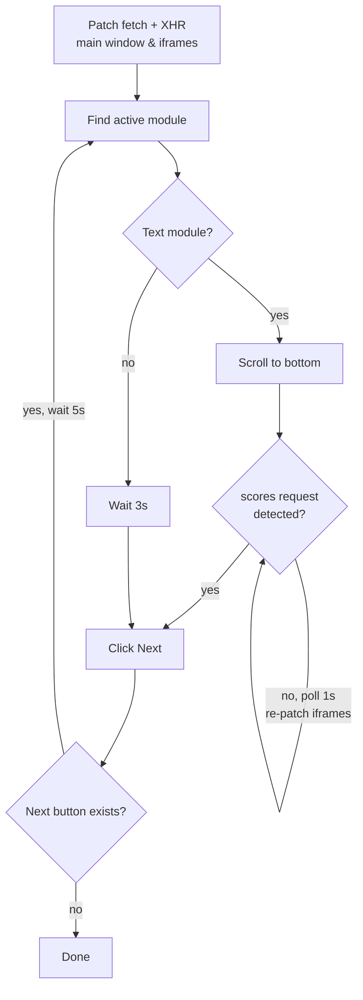

# Auto-Advance Module Navigator

> Browser console script that auto-advances through course modules, using network interception to confirm the server actually recorded completion before moving on.

No extensions, no dependencies. Paste it in the console and walk away.

## Features

- **Server-verified progression** — waits for the platform's own `scores` API call instead of trusting UI state
- **Dual interception** — patches both `fetch` and `XMLHttpRequest`, so it catches the signal regardless of how the platform makes the call
- **Iframe-aware** — re-patches frames every second to survive reloads between modules
- **Module-type detection** — text modules gate on the completion signal; everything else gets a timed pass
- **Passive** — interceptors read URLs and pass requests through untouched

## Usage

1. Open the course page
2. Open DevTools (`F12`) → **Console**
3. Paste the script and hit `Enter`

```
Text module: Waiting for server score...
[DETECTION] Signal caught in Frame!
Success. Moving on.
```

Refresh the page to stop. Everything lives in the page context, nothing persists.

## How It Works



The core idea: a UI checkmark can render before the server saves anything, but the `scores` request leaving the browser is ground truth. The script monkey-patches `window.fetch` and `XMLHttpRequest.prototype.open` to watch for that request, flips a shared flag when it appears, and only then advances.

<details>
<summary><b>Why re-patch iframes every second?</b></summary>
<br/>

Navigating to a new module often reloads or recreates the content iframe. A reload replaces the iframe's `window` object with a fresh one that has the original, unpatched `fetch` and XHR — so a one-time patch goes blind after the first module. Re-applying each polling tick keeps the hook alive. Cross-origin frames throw a `SecurityError` on access and are silently skipped.

</details>

<details>
<summary><b>Why the 5 second delay after clicking Next?</b></summary>
<br/>

The platform is an SPA. Without the buffer, the next loop iteration reads stale DOM — the previous module's active link and buttons — and misidentifies the module type.

</details>

## Limitations

| Issue | Impact |
|---|---|
| Cross-origin iframes can't be patched | If the score call fires from one, the script polls forever |
| `scores` is a substring match | Unrelated URLs containing it trigger early advancement |
| Platform-specific selectors | A frontend redesign breaks navigation or type detection |
| No verification on non-text modules | Videos/quizzes get a flat 3s wait, nothing confirmed |

## Disclaimer

Built for personal use on platforms where automated progression doesn't violate terms of service. Check yours.
